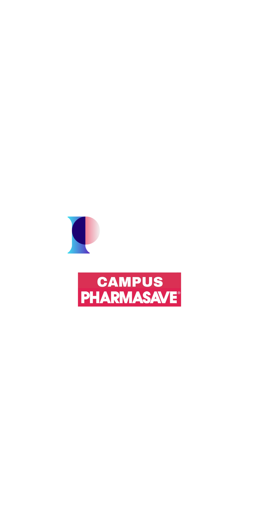

# CampusPharmasave

<p align="center">
  
</p>

<p align="center">
  <b>The Ultimate Pharmacy Experience for Campus Communities</b>
</p>

<p align="center">
  <a href="#features">Features</a> •
  <a href="#tech-stack">Tech Stack</a> •
  <a href="#getting-started">Getting Started</a> •
  <a href="#architecture">Architecture</a> •
  <a href="#contributing">Contributing</a> •
  <a href="#license">License</a>
</p>

## 🚀 Overview

CampusPharmasave is a cutting-edge mobile application designed to revolutionize the pharmacy experience for university and college communities. Our platform connects students, faculty, and staff with essential pharmacy services, personalized health recommendations, and an innovative rewards program - all in one seamless mobile experience.

## ✨ Features

- **Secure Authentication** - Robust user authentication system with email signup and profile management
- **Personalized Dashboard** - Custom health insights and recommendations based on user profiles
- **Rewards Program** - Earn points with every interaction and redeem for exclusive benefits
- **Cross-Platform** - Beautiful native experience on both iOS and Android devices
- **Offline Support** - Core functionality works even without an internet connection
- **Real-time Updates** - Instant notifications for prescriptions, health alerts, and campus events

## 🛠️ Tech Stack

CampusPharmasave leverages a powerful, modern tech stack:

- **React Native** - Core framework for cross-platform mobile development
- **TypeScript** - Type-safe code that scales
- **MobX State Tree** - Sophisticated state management
- **Supabase** - Backend as a Service for authentication, database, and storage
- **Expo** - Streamlined development workflow and easy deployment
- **React Navigation** - Smooth, native-feeling navigation system

## 🏁 Getting Started

### Prerequisites

- Node.js (v14 or newer)
- npm or yarn
- iOS/Android development environment

### Installation

```bash
# Clone the repository
git clone https://github.com/yourusername/campus-pharmasave.git

# Navigate to the project directory
cd campus-pharmasave

# Install dependencies
npm install
# or
yarn install

# Start the development server
npm start
# or
yarn start
```

## 📱 Running on Devices

```bash
# Run on iOS
npm run ios
# or
yarn ios

# Run on Android
npm run android
# or
yarn android
```

## 🏗️ Architecture

CampusPharmasave follows a clean, modular architecture:

```
app/
├── components/     # Reusable UI components
├── models/         # MobX State Tree models
├── navigators/     # Navigation configuration
├── screens/        # Application screens
├── services/       # API and external services
├── theme/          # Styling and theming
├── utils/          # Utility functions
└── app.tsx         # Application entry point
```

## 🧪 Testing

```bash
# Run tests
npm test
# or
yarn test

# Run tests in watch mode
npm run test:watch
# or
yarn test:watch
```

## 🙏 Acknowledgements

- Special thanks to the entire development team
- University partners for their valuable feedback
- All beta testers who helped shape the application

---

<p align="center">
  Made with ❤️ by the Pillthought Team
</p>
